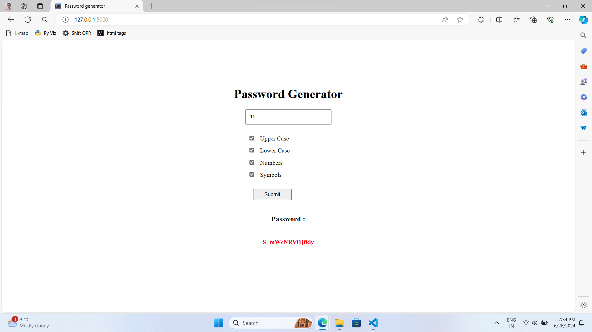

# Password Generator

## Description

A simple and secure password generator web application built with HTML, CSS, JavaScript, and Python Flask. This application generates strong and random passwords to help you secure your online accounts.

## Features

- Generate strong, random passwords
- Customize password length
- Include or exclude uppercase letters, lowercase letters, numbers, and special characters
- User-friendly interface
- Lightweight and easy to deploy

## Technologies Used

- Frontend: HTML, CSS
- Backend: Python Flask

## Screenshots


*Home Page of the Password Generator*

## Installation

### Prerequisites

- Python 3.x
- Flask
- Git (optional)

### Steps

1. **Clone the repository** (or download the zip file):

```bash
git clone https://github.com/yourusername/password-generator.git
cd password-generator
```

2. **Install the required Python packages**:

```bash
pip install -r requirements.txt
```

3. **Run the Flask app**:

```bash
python app.py
```

4. **Open your browser** and navigate to `http://127.0.0.1:5000`.

## Usage

1. Open the application in your browser.
2. Select your desired password length and character options.
3. Click the "Generate Password" button.
4. Copy the generated password and use it for your accounts.

## Project Structure

```
password-generator/
│
├── static/
│   └── css
│       └── styles.css
│   
│       
│
├── templates/
│   └── index.html
│
├── app.py
└── README.md
```

## Contributing

Contributions are welcome! Please fork the repository and create a pull request with your changes. Make sure to follow the existing code style and include tests for new features or bug fixes.
